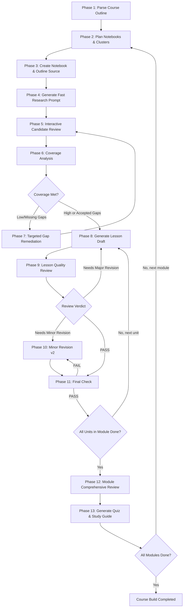

# NotebookLM Course Builder Skill

**[English](README.en.md) | [繁體中文](README.md)**

[](https://skills.sh/hmj1026/notebooklm-course-builder/notebooklm-course-builder)
[](https://github.com/hmj1026/notebooklm-course-builder/releases)
[](LICENSE)

A systematic AI Agent skill that transforms raw course syllabi into source-grounded, verified, and complete curricula in Google NotebookLM using a 14-stage wizard methodology.

---

## 📋 Overview

**NotebookLM Course Builder Skill** is an agentic instruction suite designed for AI coding assistants (such as Google Antigravity, Claude Code, Cursor, Windsurf, etc.). It guides instructors, developers, and educators through a structured **14-stage Wizard Workflow**, transforming high-level syllabi into lesson handouts with authoritative citations, verified technical accuracy, zero knowledge gaps, and accompanying quizzes and study guides.

### Core Philosophy

- **Wizard Mode**: Advances one actionable step at a time. Never overwhelms the user with huge walls of prompts upfront.
- **Strict Separation of 3 NotebookLM Objects**: Eliminates the common mistake of saving a "Research Prompt" as a Notebook Source.
- **Minimal Sufficient Source Set**: Prioritizes source quality, authority, and relevance over sheer volume. Filters out SEO content farms and outdated materials.
- **Dual-Tier Quality Gates**: Unit-level review with explicit verdicts (`PASS` / `Needs Minor Revision` / `Needs Major Revision`), followed by comprehensive end-of-module integration checks.

> 🚀 **New here?** Start with [docs/first-course-tutorial.md](docs/first-course-tutorial.md) for a 15-minute hands-on tutorial from project setup to completing your first course module!

---

## 🎯 When to Use

- Building comprehensive technical or domain-specific courses using Google NotebookLM.
- Converting an existing syllabus into modular, cited lesson drafts without hallucinations.
- Ensuring every technical claim in educational materials is backed by authoritative primary sources.
- Managing multi-module course projects across multiple dedicated Notebooks with persistent state tracking.
- Generating scenario-based quizzes and conceptual study guides for student or team onboarding.

---

## 📁 Repository Structure

```
notebooklm-course-builder/
├── SKILL.md                          # Main skill file (14-phase wizard methodology & interaction contract)
├── README.md                         # Project documentation (繁體中文)
├── README.en.md                      # Project documentation (English)
├── LICENSE                           # MIT License
├── .gitignore                        # Git ignore rules
├── agents/                           # Cross-platform agent configurations
│   └── openai.yaml                   # OpenAI Codex / Agent Skills specification sidecar
├── docs/                             # Manuals & Tutorials
│   └── first-course-tutorial.md      # Hands-on tutorial: Build your first course from scratch
├── references/                       # Progressive disclosure deep dives
│   ├── checklist.md                  # Complete 14-stage checklist & anti-pattern guardrails
│   ├── notebooklm-ui-guide.md        # Exact 3-panel UI mapping, button names & input locations
│   ├── research-and-sources.md       # Source research prompt design, review matrix & coverage rules
│   ├── lesson-production.md          # Lesson draft generation, review & revision guidelines
│   └── module-completion.md          # Module-level review, quiz & study guide specifications
├── templates/                        # Reusable templates
│   ├── build-state.md                # Course build-state tracking sheet (SSOT)
│   └── course-outline-template.md    # Standard course outline / syllabus input template
├── scripts/                          # Automation & helper scripts
│   ├── README.md                     # Script documentation
│   ├── init-course.sh                # Scaffolding script for new course workspaces
│   └── validate-state.sh             # Build-state completeness & gate validation script
└── examples/                         # Real-world end-to-end examples
    ├── README.md                     # Example catalog
    └── python-async-course/          # Complete Python Async Programming course build
        ├── syllabus.md               # Raw syllabus input
        ├── build-state.md            # Persisted build-state ledger
        └── prompts-and-review.md     # Actual wizard dialogue, prompts, review verdicts
```

---

## 🔄 14-Stage Workflow



---

## 📑 Key Milestones & Acceptance Criteria

| Phase | Core Action | Primary Output | Acceptance Criteria |
|---|---|---|---|
| **Phase 1** | Parse Syllabus | Course Map & Boundaries | Unit dependencies, audience level, and non-goals confirmed |
| **Phase 2-3** | Plan Notebook & Clusters | Notebook Name & Cluster List | Outline added as Source; research prompts strictly isolated |
| **Phase 4-5** | Research & Review Candidates | Source Ledger Table | Every candidate tagged `Import` / `Optional` / `Do Not Import` with rationale |
| **Phase 6-7** | Evaluate Knowledge Coverage | Coverage Analysis Matrix | No unaddressed Low/Missing ratings; sufficient for technical drafting |
| **Phase 8-11** | Unit Draft & Review | Production Lesson (`.md`) | PASS on review & final check; preserves native NotebookLM citations |
| **Phase 12-13** | Module Review & Mastery Tools | Quiz Bank & Study Guide | PASS + YES achieved; zero conceptual regressions or gaps |
| **Phase 14** | Archive & Advance | Archived Module Artifacts | Build state updated; ready for next module |

---

## 🚀 Quick Start

### 0. Install the Skill (Choose One)

- **🌟 Method A (Recommended - skills.sh one-click install)**:
  ```bash
  npx skills add hmj1026/notebooklm-course-builder
  ```
- **🤖 Method B (AI-Assisted - Copy & paste to your AI assistant)**:
  > "Please install the `https://github.com/hmj1026/notebooklm-course-builder` skill into my current environment's skills directory (Claude Code / Claude Cowork / ChatGPT App / Antigravity / Cursor) and confirm readiness."
- **💻 Method C (Manual installation)**:
  See [docs/first-course-tutorial.md](docs/first-course-tutorial.md#步驟-0環境準備與技能安裝新手無痛指南) for exact directory paths for ChatGPT App, Claude Cowork, Antigravity, and Codex.

### 1. Prepare Your Course Outline

Copy [templates/course-outline-template.md](templates/course-outline-template.md) and fill in your course details:

```markdown
- Course Name: [Your course title]
- Target Audience: [Learner background and prerequisites]
- Course Depth: [Beginner / Intermediate / Advanced]
- Core Mental Model: [Central conceptual metaphor]
- Out of Scope: [Explicit non-goals]
- Modules & Units: [Structured outline]
```

### 2. Initialize Course Directory (Optional)

Use the provided helper script to scaffold a workspace:

```bash
# Scaffold new course directory
./scripts/init-course.sh my-course

# Edit your outline
vim courses/my-course/course-outline.md
```

### 3. Prompt Your AI Assistant

Provide the outline to your AI coding assistant (Google Antigravity, Claude Code, Cursor, etc.):

```text
Please use the notebooklm-course-builder skill to help me build a complete course based on this syllabus:

[Paste your syllabus content here]
```

The AI assistant will initiate Wizard Mode starting with **Phase 1: Course Outline Analysis**.

---

## 🛠️ Helper Scripts

Utility bash scripts are located in `scripts/` (see [scripts/README.md](scripts/README.md)):

- **`./scripts/init-course.sh <name>`**: Scaffolds `courses/<name>/` with populated `build-state.md` and `course-outline.md`.
- **`./scripts/validate-state.sh <path>`**: Validates your `build-state.md` against missing fields, unresolved gaps, and review bottlenecks.

---

## 📖 Core Methodology & Guardrails

### 1. Three Disjoint NotebookLM Objects

1. **Course Outline Source**: The syllabus itself, imported into the notebook as permanent context.
2. **Research Prompt**: Input to Fast Research; **must never be imported as a notebook source**.
3. **Candidate Source**: Search results; only imported after explicit, item-by-item review.

### 2. Three-Tier Source Review

Evaluated against 7 quality criteria: Relevance, Authority, Direct Evidence, Freshness, Pedagogical Fit, Unique Value, and Boundary Risk:
- **`Import`**: Directly supports core outcomes with authoritative backing.
- **`Optional`**: Supplementary examples or alternative pedagogical analogies.
- **`Do Not Import`**: SEO farms, outdated APIs, off-topic, or excessive redundancy.

### 3. Objective Lesson Review

Reviews strictly enforce three actionable verdicts:
- **`PASS`**: No technical errors or missing core outcomes. Finalize draft.
- **`Needs Minor Revision`**: Surgical, actionable fixes without structural shifts. Produces v2.
- **`Needs Major Revision`**: Conceptual failure or missing sources. Returns to research/outline phase.
> Stylistic or aesthetic preferences do not constitute grounds for requesting revisions.

---

## 🎓 Best Practices

1. **Step-by-Step Discipline**: Advance one verified gate at a time. Grounding in NotebookLM requires incremental, validated steps.
2. **Value Precision over Volume**: Strive for a "Minimal Sufficient Source Set" — 4–5 authoritative sources far outperform 30 unvetted articles.
3. **Screenshot-Assisted Triage**: When NotebookLM returns candidate sources, provide a quick screenshot for rapid AI parsing without manual typing.
4. **State Persistence**: Maintain `build-state.md` to enable seamless session resumes anytime with `/resume`.

---

## 🔧 Skill Design Principles

Built strictly adhering to modern open Agent Skill specifications (natively compatible with Anthropic Claude Code, Google Antigravity, and OpenAI Codex / skills.sh):

- ✅ **Cross-Platform Standard**: Includes `SKILL.md` (universal standard) and `agents/openai.yaml` (OpenAI sidecar), ensuring seamless portability across major agent tools.
- ✅ **Standard YAML Frontmatter**: Precise `name` and trigger-rich `description`.
- ✅ **Progressive Disclosure**: Concise `SKILL.md` (< 200 lines) with modular `references/` to minimize context token usage.
- ✅ **Verifiable Milestones**: Explicit completion criteria and user response formats per step.
- ✅ **Reproducible Templates & Verification**: Complete examples, reusable templates, and CLI inspection scripts.

---

## 🤝 Contributing

Contributions, enhancements, and suggestions are welcome!

1. Fork the repository
2. Create your feature branch (`git checkout -b feature/AwesomeFeature`)
3. Commit your changes (`git commit -m 'feat: Add awesome feature'`)
4. Push to the branch (`git push origin feature/AwesomeFeature`)
5. Open a Pull Request

---

## 📄 License

This project is licensed under the MIT License - see the [LICENSE](LICENSE) file for details.

---

## 🔗 Related Resources

- [docs/first-course-tutorial.md](docs/first-course-tutorial.md) - Hands-on Tutorial: Build Your First Course
- [SKILL.md](SKILL.md) - Main Skill Instructions
- [references/notebooklm-ui-guide.md](references/notebooklm-ui-guide.md) - NotebookLM UI & Button Operation Manual
- [references/checklist.md](references/checklist.md) - 14-Stage Checklists
- [references/research-and-sources.md](references/research-and-sources.md) - Research & Source Evaluation Guide
- [references/lesson-production.md](references/lesson-production.md) - Lesson Production Guidelines
- [references/module-completion.md](references/module-completion.md) - Module Completion & Quiz Standards
- [examples/python-async-course/](examples/python-async-course/) - End-to-End Course Build Example
- [Google NotebookLM](https://notebooklm.google.com/) - Official Service
