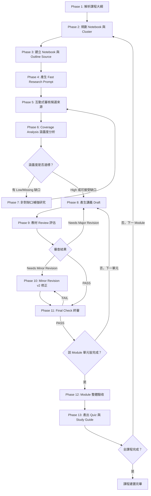

# NotebookLM Course Builder Skill

**[English](README.en.md) | [繁體中文](README.md)**

[](https://skills.sh/hmj1026/notebooklm-course-builder/notebooklm-course-builder)
[](https://github.com/hmj1026/notebooklm-course-builder/releases)
[](LICENSE)

一個將課程大綱轉化為系統化、具權威來源引用的完整 NotebookLM 課程建置 AI Agent 技能。

---

## 📋 概述

**NotebookLM Course Builder Skill** 是一套專為 AI 程式助手（如 Google Antigravity、Claude Code、Cursor 等）設計的專業建課技能。它採用嚴謹的 **14 階段嚮導模式 (Wizard Mode)**，協助講師與內容開發者將粗略的課程大綱（Syllabus）轉化為具備官方文獻佐證、技術正確、無知識斷層且附帶測驗與複習指南的高品質教材。

### 核心哲學

- **嚮導模式 (Wizard Mode)**：每次只推進一個可完成的步驟，避免一次性輸出大量 Prompt 造成混淆。
- **嚴格區隔三大物件**：徹底杜絕將「研究提示詞 (Research Prompt)」誤存為筆記本來源（Source）的常見錯誤。
- **最小充分來源集 (Minimal Sufficient Source Set)**：堅持品質勝於數量，逐項審核切題性與權威度，拒絕 SEO 農場文與過時資訊。
- **雙重品質把關機制**：單課進行 3 級 Review (PASS / Minor / Major) 與 Final Check；全模組完成後進行跨單元整合驗收。

> 🚀 **新手初次上手？** 請直接閱讀 [docs/first-course-tutorial.md](docs/first-course-tutorial.md)（從開專案到完成第一堂課的 15 分鐘手把手教學）。

---

## 🎯 適用情境

- 想要利用 Google NotebookLM 製作高品質技術或專業課程
- 手邊已有初步大綱，需要轉化為具備官方權威引用、架構完整的逐節講義
- 希望防止 AI 幻覺，確保教材內容 100% 有文獻與原始規格支撐
- 需管理跨多個 Module、多本 Notebook 的大型系列課程
- 為團隊或學員製作附帶情境測驗（Quiz）與學習心智模型指南（Study Guide）的自學體系

---

## 📁 專案架構

```
notebooklm-course-builder/
├── SKILL.md                          # 技能主檔案（14 階段嚮導方法論與互動契約）
├── README.md                         # 專案說明文件（繁體中文）
├── README.en.md                      # 專案說明文件（English）
├── LICENSE                           # MIT 授權條款
├── .gitignore                        # Git 忽略設定
├── agents/                           # 跨平台代理擴充設定
│   └── openai.yaml                   # OpenAI Codex / Agent Skills 規格設定檔
├── docs/                             # 詳細手冊與教學
│   └── first-course-tutorial.md      # 從零到一建立第一堂課的手把手教學
├── references/                       # 深入指引與參考文件（漸進式載入）
│   ├── checklist.md                  # 14 階段建課查核清單與防呆守則
│   ├── notebooklm-ui-guide.md        # NotebookLM 三大面板、按鈕名稱與輸入位置對照手冊
│   ├── research-and-sources.md       # 來源研究、審核矩陣與 Coverage 評估指南
│   ├── lesson-production.md          # 逐節講義生成、審查與修訂規範
│   └── module-completion.md          # Module 整體驗收、Quiz 與 Study Guide 規範
├── templates/                        # 格式範本
│   ├── build-state.md                # 建課狀態追蹤表（核心進度追蹤）
│   └── course-outline-template.md    # 課程大綱輸入範本
├── scripts/                          # 自動化輔助工具
│   ├── README.md                     # 腳本說明
│   ├── init-course.sh                # 快速初始化新課程工作區
│   └── validate-state.sh             # 狀態表完整性與關卡驗證腳本
└── examples/                         # 完整實戰案例
    ├── README.md                     # 範例導覽
    └── python-async-course/          # Python 非同步程式設計建課範例
        ├── syllabus.md               # 原始大綱
        ├── build-state.md            # 建課歷程狀態表
        └── prompts-and-review.md     # 實際對話提示詞與審核歷程
```

---

## 🔄 14 階段工作流程



---

## 📑 關鍵關卡與判準

| 階段 | 關鍵動作 | 產出成果 | 完成判準 |
|---|---|---|---|
| **Phase 1** | 解析 Syllabus | 課程地圖與邊界設定 | 確認單元依賴、目標受眾與明確不教範圍 |
| **Phase 2-3** | 規劃筆記本與分群 | Notebook 名稱與 Cluster 清單 | 大綱成為 Course Outline Source，防呆排除指令 |
| **Phase 4-5** | 發起研究與來源審核 | Source Ledger 決策表 | 逐項標記 `Import` / `可選` / `不要 Import` 並具備理由 |
| **Phase 6-7** | 評估知識涵蓋度 | Coverage Analysis 矩陣 | 無未解釋的 Low/Missing，達到可撰寫標準 |
| **Phase 8-11** | 逐節講義產出與審查 | 正式單元講義 (`.md`) | 通過 Review 與 Final Check，具備 NotebookLM 原生引用 |
| **Phase 12-13** | 模組總體驗收 | Quiz 題庫與 Study Guide | 達成 `PASS + YES`，消除知識斷層與跨節矛盾 |
| **Phase 14** | 封存並推進 | 模組成果存檔 | 狀態表更新完成，進入下一 Module |

---

## 🚀 快速開始

### 0. 安裝技能（三選一）

- **🌟 方式 A（最推薦 - skills.sh 一鍵安裝）**：
  ```bash
  npx skills add hmj1026/notebooklm-course-builder
  ```
- **🤖 方式 B（AI 幫你裝 - 直接複製貼給你的 AI 助手）**：
  > 「請幫我安裝 `https://github.com/hmj1026/notebooklm-course-builder` 技能至目前環境（Claude Code / Claude Cowork / ChatGPT App / Antigravity / Cursor）的技能目錄中並確認就緒。」
- **💻 方式 C（手動安裝）**：
  各平台詳細目錄（含 ChatGPT App、Claude Cowork、Antigravity）請參考 [docs/first-course-tutorial.md](docs/first-course-tutorial.md#步驟-0環境準備與技能安裝新手無痛指南)。

### 1. 準備課程大綱

複製 [templates/course-outline-template.md](templates/course-outline-template.md)，填寫您的課程資訊：

```markdown
- 課程名稱：[您的課程名稱]
- 目標受眾：[目標學習者與先備知識]
- 課程深度：[入門 / 中階實戰 / 進階]
- 核心心智模型：[全課程最關鍵的核心理解比喻]
- 明確不涵蓋範圍：[邊界限制]
- 單元規劃：Module 與 Unit 清單
```

### 2. 使用輔助腳本初始化（可選）

在終端機中快速建立課程工作區：

```bash
# 初始化新課程目錄
./scripts/init-course.sh my-course

# 編輯 course-outline.md
vim courses/my-course/course-outline.md
```

### 3. 向 AI 助手下達指令

將大綱貼給 AI 助手（例如在 Antigravity、Claude Code 或 Cursor 中）：

```text
請使用 notebooklm-course-builder 技能，根據以下課程大綱協助我建立完整課程：

[貼上您的課程大綱內容]
```

AI 助手將啟動嚮導模式，從「Phase 1: 課程大綱解析」開始引導您完成每一步驟。

---

## 🛠️ 輔助工具腳本

本專案提供 Bash 實用腳本，詳見 [scripts/README.md](scripts/README.md)：

- **`./scripts/init-course.sh <name>`**：建立 `courses/<name>/` 並放置初始 `build-state.md` 與 `course-outline.md`。
- **`./scripts/validate-state.sh <path>`**：解析並檢查狀態表，提早發現未解的來源缺口或待審查單元。

---

## 📖 核心規範與防呆機制

### 1. 不可混淆的三大 NotebookLM 物件

1. **Course Outline Source**：大綱本身，加入 Notebook 作為常駐知識背景來源。
2. **Research Prompt**：輸入快速研究搜尋框的提示詞，**絕對不要加入成 Source**。
3. **Candidate Source**：搜尋到的候選網頁／文獻，經三級審查核准後才可 Import。

### 2. 來源三級審核標準

依據「切題性、權威性、證據直接性、新鮮度、教學適配、獨特價值、邊界風險」七大維度判斷：
- **`Import`**：直接支援核心知識點、具備官方/權威背書且非重複。
- **`可選`**：補充案例或白話教學觀點，視需要納入。
- **`不要 Import`**：SEO 農場文、過時語法、主題偏離、產品線混淆或過度繁雜。

### 3. 講義品質客觀審查

Review 僅允許三種客觀判定：
- **`PASS`**：無技術錯誤或嚴重缺陷，直接定稿。
- **`Needs Minor Revision`**：列出具體、可執行的修正清單，產生 v2。
- **`Needs Major Revision`**：存在結構性問題或來源嚴重不足，退回補強來源。
> 嚴格禁止因個人文風、措辭偏好或排版要求推翻講義。

---

## 🎓 使用最佳實踐

1. **堅持步驟推進**：遵循嚮導模式逐步確認，守住每階段的上下文與來源品質。
2. **謹慎看待來源數量**：追求「最小充分來源集」，5 篇切題且權威的來源，遠勝過 30 篇品質參差不齊的網路文章。
3. **截圖回傳支援**：當 NotebookLM 搜尋出候選來源時，直接截圖回傳供 AI 快速辨識，大幅降低打字搬運成本。
4. **狀態表持久化**：持續維護 `build-state.md`，支援隨時以 `/resume` 無縫接軌建課進度。

---

## 🔧 技能設計原則

本專案嚴格遵循開放標準 Agent Skill 架構規範（原生相容於 Anthropic Claude Code、Google Antigravity 與 OpenAI Codex / skills.sh 體系）：

- ✅ **跨平台標準規範**：具備 `SKILL.md`（通用標準）與 `agents/openai.yaml`（OpenAI 側車設定），無縫相容各主流 Agent 工具。
- ✅ **清晰的 YAML Frontmatter**：包含精準的 `name` 與觸發情境 `description`。
- ✅ **漸進式揭露 (Progressive Disclosure)**：`SKILL.md` 聚焦流程與互動契約，細節深入拆分於 `references/`，大幅節省上下文 Token。
- ✅ **可驗證性與防呆機制**：定義每個步驟的「完成判準」與「使用者回傳格式」。
- ✅ **完整範例與工具健全性**：內建完整案例、範本與自動化檢驗腳本。

---

## 🤝 貢獻

歡迎提交 Issue 或 Pull Request 共同改進建課方法論！

1. Fork 本專案
2. 建立功能分支 (`git checkout -b feature/AmazingImprovement`)
3. 提交變更 (`git commit -m 'feat: Add amazing improvement'`)
4. 推送分支 (`git push origin feature/AmazingImprovement`)
5. 發起 Pull Request

---

## 📄 授權條款

本專案採用 MIT 授權條款 - 詳見 [LICENSE](LICENSE) 檔案。

---

## 🔗 相關資源

- [docs/first-course-tutorial.md](docs/first-course-tutorial.md) - 新手入門：手把手建立第一堂課
- [SKILL.md](SKILL.md) - 技能核心方法論
- [references/notebooklm-ui-guide.md](references/notebooklm-ui-guide.md) - NotebookLM 介面與按鈕導覽手冊
- [references/checklist.md](references/checklist.md) - 14 階段查核清單
- [references/research-and-sources.md](references/research-and-sources.md) - 來源研究與審查矩陣
- [references/lesson-production.md](references/lesson-production.md) - 講義產出與審核指引
- [references/module-completion.md](references/module-completion.md) - 模組驗收與測驗規範
- [examples/python-async-course/](examples/python-async-course/) - 完整實戰案例
- [Google NotebookLM](https://notebooklm.google.com/) - 官方服務
