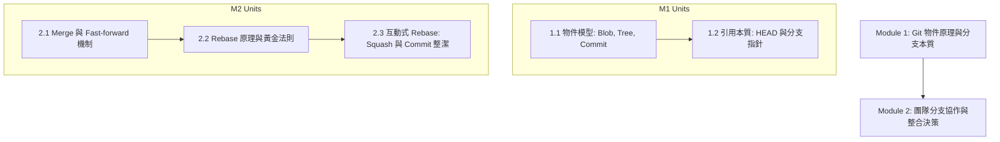

# 手把手教學：從零到一建立你的第一堂 NotebookLM 課程

本教學專為剛安裝 **`notebooklm-course-builder`** 技能的開發者、講師與教育工作者設計。我們將以一個真實且極簡的課程案例——**《Git 版本控制與團隊協作實戰》**，帶你完整走過一次從專案初始化、大綱吸納、來源研究、講義生成、同串內審、到測驗產出的完整閉環。

---

## 🧭 全流程體驗地圖

```
[本機終端機 / AI 代理]                                   [Google NotebookLM 網頁]
       │                                                          │
   1. 專案初始化與課綱確認                                           │
       │                                                          │
   2. 規劃 Notebook 與研究分群                                      │
       │                                                          │
   3. 指引建立 Notebook ────────────────────────────────────► 建立 Notebook 並匯入大綱
       │                                                          │
   4. 提供 Fast Research Prompt ───────────────────────────► 貼入快速研究搜尋框
       │                                                          │
   5. 截圖回傳 ◄───────────────────────────────────────────── 截取候選清單
       │                                                          │
   6. 輸出審核表與極簡勾選碼 ──────────────────────────────────► 勾選通過項目並點擊匯入
       │                                                          │
   7. 提供講義 Draft Prompt ────────────────────────────────► 貼入中央對話框生成講義
       │                                                          │
   8. 提供同串審查 Review Prompt ──────────────────────────► 同串對話貼入自檢
       │                                                          │
   9. 回傳 PASS 判定 ◄──────────────────────────────────────── 確認通過
       │                                                          │
  10. 指引儲存至記事 ────────────────────────────────────────► 點擊「儲存至記事」存檔
       │                                                          │
  11. 產出 Quiz & Study Guide ──────────────────────────────► 右側工作室面板一鍵生成
```

---

## 步驟 0：環境準備與技能安裝（新手無痛指南）

在開始建課前，你需要將 `notebooklm-course-builder` 安裝至你的 AI 助手環境中。本專案符合開放 Agent Skills 標準，原生支援 **Claude Code / Claude Cowork**、**ChatGPT App / OpenAI Codex**、**Google Antigravity** 與 **Cursor**。

請選擇最適合你的安裝方式（三選一）：

---

### 🌟 方法 A：使用 skills.sh 一鍵安裝（最推薦、最簡單）

[skills.sh](https://skills.sh) 是開放的 AI Agent 技能管理器，能自動識別並安裝至你的環境：

```bash
# 使用 npx 快速安裝（無需預先安裝任何全域工具）
npx skills add hmj1026/notebooklm-course-builder

# 或如果你已安裝 skills CLI：
skills add hmj1026/notebooklm-course-builder
```

---

### 🤖 方法 B：懶人救星——讓 AI 助手幫你裝（直接貼提示詞）

如果你不熟悉終端機指令或資料夾路徑，**最輕鬆的做法是直接把下面這段提示詞複製貼給你的 AI 助手**（無論是 Claude、ChatGPT App、Google Antigravity 或 Cursor）：

> 📋 **複製下方提示詞，貼入你的 AI 聊天對話框**：
>
> ```text
> 請幫我安裝「NotebookLM 課程建置 (notebooklm-course-builder)」技能。
> GitHub 存放庫網址為：https://github.com/hmj1026/notebooklm-course-builder
> 
> 請幫我執行以下任務：
> 1. 偵測目前的工作環境（例如 Claude Code / Claude Cowork、Google Antigravity、ChatGPT App / Codex 或 Cursor）。
> 2. 找到此環境專屬的技能存放目錄（例如 ~/.claude/skills/、~/.gemini/config/skills/、~/.codex/skills/ 或專案內的 .claude/skills/）。
> 3. 自動將 GitHub 存放庫 clone 或下載軟連結至該目錄。
> 4. 檢查並確認主規約 SKILL.md 與 agents/openai.yaml 是否就位，完成後向我回報。
> ```

AI 助手收到後會自動為你下載並配置到正確路徑，完全不需要手動翻找目錄！

---

### 💻 方法 C：各大主流平台手動安裝路徑

若你想手動將技能放置於指定環境，請參考各平台的標準目錄：

#### 1. Claude Cowork / Claude Code / Claude Desktop
- **全域技能目錄**（建議）：
  ```bash
  git clone https://github.com/hmj1026/notebooklm-course-builder.git ~/.claude/skills/notebooklm-course-builder
  ```
- **單一專案專用**（Cowork 工作區）：
  在你的工作專案根目錄下建立目錄並軟連結：
  ```bash
  mkdir -p .claude/skills
  ln -s /path/to/notebooklm-course-builder .claude/skills/notebooklm-course-builder
  ```

#### 2. ChatGPT App / OpenAI Codex
- **Codex 技能目錄**：
  ```bash
  git clone https://github.com/hmj1026/notebooklm-course-builder.git ~/.codex/skills/notebooklm-course-builder
  ```
- **ChatGPT App / Desktop**：
  在 ChatGPT 工作區或專案設定中，將本專案目錄掛載或加入為技能。本專案已內建 `agents/openai.yaml` 側車設定檔，ChatGPT 會自動識別顯示名稱「NotebookLM Course Builder」與預設啟動提示詞。

#### 3. Google Antigravity / Gemini CLI
- **Antigravity 全域技能目錄**：
  ```bash
  git clone https://github.com/hmj1026/notebooklm-course-builder.git ~/.gemini/config/skills/notebooklm-course-builder
  ```

#### 4. Cursor / VS Code (AI Agent)
- 在專案工作區根目錄中放入：
  ```bash
  mkdir -p .cursor/skills
  cp -r /path/to/notebooklm-course-builder .cursor/skills/
  ```

---

### ✅ 驗證安裝是否就緒

安裝完成後，在你的 AI 助手聊天對話中輸入：

> 「我想規劃一門新課程，請使用 notebooklm-course-builder 技能協助我。」

只要 AI 代理回應了：
`📍 [進度: 全課規劃 / 大綱解析]`
或開始引導你輸入課程目標，就代表技能已成功啟動！

---

## 步驟 1：建立課程專案工作區

我們為你準備了自動化初始化腳本，能一秒建立標準目錄與追蹤狀態表：

```bash
# 1. 進入你的課程存放目錄
cd ~/projects

# 2. 執行初始化腳本（指定專案資料夾與課程名稱）
/path/to/notebooklm-course-builder/scripts/init-course.sh git-course "Git 版本控制與團隊協作" "初中階軟體工程師"
```

執行後會建立以下結構：
```
git-course/
├── syllabus.md           # 課程大綱檔
├── build-state.md        # 課程建置歷程與決策追蹤表 (SSOT)
├── output/               # 正式講義產出存放處
└── notes/                # 參考筆記
```

---

## 步驟 2：喚醒 AI 代理與大綱輸入（實戰開始）

### 💬 使用者在聊天室輸入：
你可以直接貼入零散的筆記或粗略想法，技能支援**雜湊文字吸納模式**：

> 「我想為團隊內部建立一門《Git 版本控制與團隊協作》課程，受眾是懂基本指令但常遇到 Conflict、不知道如何 rebase 與整理 commit 的初中階工程師。大綱大概有：Git 內部原理（Blob/Tree/Commit/HEAD）、分支管理與 Fast-forward、Rebase vs Merge 決策、互動式 rebase 整理 commit。不教 GitHub Actions CI/CD。」

### 🤖 AI 代理回覆：
AI 自動結構化大綱，繪製 Mermaid 拓撲依賴圖，並建立防呆邊界：

```text
📍 [進度: 全課規劃 / 大綱解析]

已為您解析課程結構與先備關係：
- 課程名稱：Git 版本控制與團隊協作實戰
- 目標受眾：具備基本 add/commit 經驗，需強化團隊協作與心智模型的工程師
- 明確不教：GitHub Actions CI/CD、Git 內部 C 原始碼實作

課程結構拓撲：
```

```text
完成判準：請確認 Module 與單元結構是否符合預期？
👉 快速操作／回傳：若無修改請回傳「確認」，我們將展開 Module 1 規劃。
```

---

## 步驟 3：在 NotebookLM 建立筆記本並匯入大綱

### 💬 使用者回傳：
> 「確認」

### 🤖 AI 代理回覆：
```text
📍 [進度: Module 1 / 筆記本建立]

目前：Module 1: Git 物件原理與分支本質

請在 NotebookLM：
1. 開啟 https://notebooklm.google.com/ 點擊左上角「+ 新增筆記本」，命名為「Git-M1-Object-Model」。
2. 在左側「來源 (Sources)」面板點擊「+ 新增來源」，選擇「複製的文字 (Copied text)」。
3. 貼入下方大綱文字，來源名稱填寫「Module 1 大綱」，點擊「插入」：

---
# Module 1: Git 物件原理與分支本質
- Unit 1.1: Git 物件儲存機制（Blob, Tree, Commit 物件與 SHA-1/SHA-256 定位）
- Unit 1.2: 引用（References）的本質：HEAD、分支指標與 Detached HEAD 狀態修復
---

完成判準：左側來源清單已顯示「Module 1 大綱」。
👉 快速操作／回傳：完成後請回覆「大綱已匯入」。
```

---

## 步驟 4：執行快速研究（Fast Research）與截圖回傳

### 💬 使用者回傳：
> 「大綱已匯入」

### 🤖 AI 代理回覆：
```text
📍 [進度: Module 1 / Cluster 1 來源研究]

目前：Module 1 / Research Cluster 1 (Git 物件與引用機制)

請在 NotebookLM：
在左側「來源」面板點擊「+ 新增來源」➔ 點擊「快速研究 (Fast Research)」標籤頁，將下方提示詞貼入搜尋列按 Enter：

---
請研究「Git Object Storage Mechanism and References」，作為「Module 1: Git 物件原理與分支本質」的初中階工程師教材來源。

需要支援：
- Git 三大對象（blob, tree, commit）的不可變性與內部哈希定位
- 分支指標（refs/heads）的本質只是 41 位元組檔案
- HEAD 指標的切換機制與 Detached HEAD 的本質與拯救方式
- 心智模型：Git 是一個帶有內容定址檔案系統的有向無環圖 (DAG)

來源優先：
- git-scm.com Pro Git 官方書籍（Scott Chacon）
- 權威技術文件或知名技術手冊

避免：
- 只教 `git add / git commit` 表面操作的入門文章
- 與本單元無關的 GUI 工具（SourceTree / GitKraken）點擊教學

研究目標：讓學習者建立 Git 底層物件與指標的心智模型。
不需要深入：Packed refs 與垃圾回收 (gc) 底層 C 語言演算法。
---

完成判準：NotebookLM 展開候選來源清單。
👉 快速操作／回傳：請使用 Win+Shift+S (或 Cmd+Shift+4) 直接截取候選視窗畫面貼回，無需手動複製文字！
```

---

## 步驟 5：一鍵審核與極簡勾選碼匯入

### 💬 使用者回傳：
（使用者直接在對話貼入 NotebookLM 候選來源清單截圖）

### 🤖 AI 代理回覆：
代理透過視覺辨識解析截圖，給出專業審核矩陣與**極簡操作指令**：

```text
📍 [進度: Module 1 / 來源審查]

針對截圖中的 4 個候選來源，審核結果如下：

| # | 來源標題 | 網域 | 決策 | 支援單元 | 具體理由 |
|---|---|---|---|---|---|
| 1 | Git Internals - Git Objects | git-scm.com | Import | 1.1 | Pro Git 官方書籍第 10 章，最權威的底層物件儲存規範 |
| 2 | Git Internals - Git References | git-scm.com | Import | 1.2 | 官方對於 refs 與 HEAD 本質的權威說明，不可或缺 |
| 3 | Visualizing Git Concepts | github.io | 可選 | 1.1, 1.2 | 圖解 DAG 與指標運作，適合作為心智模型輔助 |
| 4 | 5 分鐘學會 Git 常用指令 | blog.csdn.net | 不要 Import | — | 僅列常用指令，無底層原理且排版零散 |

👉 快速操作指令：
請在 NotebookLM 候選視窗中：手動勾選 [1, 2, 3]，取消勾選 [4]，點擊右下角「匯入 (Import)」按鈕。

完成判準：左側 Sources 清單顯示已匯入這 3 筆來源。
👉 快速操作／回傳：完成後請回傳「已匯入」。
```

---

## 步驟 6：涵蓋度（Coverage）評估

### 💬 使用者回傳：
> 「已匯入」

### 🤖 AI 代理回覆：
```text
📍 [進度: Module 1 / 涵蓋度分析]

目前：Module 1 Coverage Analysis

請在 NotebookLM：在中間「對話 (Chat)」面板底部的對話輸入框貼入下列指令並發送：

---
請根據目前 Notebook 的所有 Sources，對「Module 1: Git 物件原理與分支本質」做 Coverage Analysis。

單元：
- Unit 1.1: Git 物件儲存機制（Blob, Tree, Commit）
- Unit 1.2: 引用本質與 HEAD（含 Detached HEAD 狀態）

評定標準：
- 逐單元給出 High / Medium / Low / Missing
- 列出已具備之核心知識與實質缺口
---

完成判準：NotebookLM 給出各單元評級。
👉 快速操作／回傳：貼回評級結果（例如「兩單元皆為 High」）。
```

使用者回報兩單元皆為 `High`，代表來源充分，可直接啟動講義生成！

---

## 步驟 7：講義 Draft 產出（免全文搬運機制）

### 🤖 AI 代理回覆：
```text
📍 [進度: Module 1 / 單元 1.1 講義生成]

目前：Unit 1.1: Git 物件儲存機制 Draft v1

請在 NotebookLM：
在中間「對話」面板底部的對話輸入框，貼入下列短版指令並發送（確認左側 3 筆來源皆處於勾選狀態）：

---
請根據目前 Notebook Sources 製作正式講義：

# Unit 1.1: Git 物件儲存機制：Blob, Tree 與 Commit 的不可變本質
建議檔名：unit-1-1-git-object-storage.md

對象：初中階軟體工程師。
完成後，學習者應能：手繪 Git 三大物件關係圖，並解釋為何 Git 是內容定址存儲。

請依序包含：
1. 學習目標
2. 痛點情境：為什麼把 Git 當成「檔案差異快照」會導致直覺錯誤？
3. 核心概念：SHA 哈希定址、Blob 物件、Tree 目錄物件、Commit 封裝
4. 技術細節與資料流：當執行 git add 與 git commit 時，.git/objects 底層發生了什麼？
5. 心智模型：Git 的 DAG（有向無環圖）結構比喻
6. 常見迷思：Commit 可以直接被修改嗎？（Amending 的本質）
7. 課後複習檢查點 (3-5 題)

格式要求：
- 正式教材語氣，嚴謹流暢
- 依據目前 Sources 撰寫並保留原生引用標註 [1], [2]
---

完成判準：NotebookLM 生成完整講義草稿。
👉 快速操作／回傳：💡 免全文搬運！生成後不需要將長文貼回，只需回報「講義已生成」，我們將直接在同串對話進行審核！
```

---

## 步驟 8：同串內審雙閉環（In-Notebook Review Loop）

### 💬 使用者回傳：
> 「講義已生成」

### 🤖 AI 代理回覆：
代理直接給出預設的審查指令，讓 NotebookLM 在同一對話串內自檢，省去 90% 複製貼上時間：

```text
📍 [進度: Module 1 / 單元 1.1 講義審查]

目前：Unit 1.1 講義審核 (In-Notebook Review)

請在 NotebookLM：
在中間「對話」面板（延續剛才生成講義的同一個對話串）底部的輸入框，直接貼入下方審核指令發送：

---
請審查剛才產生的「Unit 1.1: Git 物件儲存機制」講義，不要重寫講義。

以資深 Git 核心架構師角度嚴格檢查：
1. 技術正確性：Blob 是否精確說明「只儲存檔案內容，不包含檔名與權限」？
2. 資料結構：Tree 物件如何將檔名、模式與 Blob/Tree SHA 連結？
3. 心智模型：是否清晰建立「Git 不記錄 diff，而是記錄完整 Tree 快照」的不可變模型？
4. 來源支援：主要技術主張是否皆有 Sources 引用支援？
5. 邊界控制：是否守住邊界，未提前深入講解 Unit 1.2 的分支指針與 HEAD？

只判定：
- PASS
- Needs Minor Revision
- Needs Major Revision

若需修改，只列具體可執行項目（不要提出文風或排版偏好）。
---

完成判準：NotebookLM 給出審查判定。
👉 快速操作／回傳：貼回判定結果（例如：「PASS」或列出 1~2 個修改項）。
```

---

## 步驟 9：Final Check 與存檔至 Studio 記事區

### 💬 使用者回傳：
> 「NotebookLM 判定 PASS，所有核心概念均精確且有來源引用。」

### 🤖 AI 代理回覆：
```text
📍 [進度: Module 1 / 單元 1.1 定稿存檔]

🎉 恭喜！Unit 1.1 已取得正式 PASS！

請在 NotebookLM：
1. 找到剛才產生的正式講義回答氣泡。
2. 點擊回答下方的「儲存至記事 (Save to note)」（便條紙圖示）。
3. 講義已安全保存至右側「工作室 (Studio)」面板的「記事」區！

本機備份指引（選用）：
您可以將講義複製貼入本機工作區存檔：
`output/unit-1-1-git-object-storage.md`

完成判準：講義已出現在右側記事清單。
👉 快速操作／回傳：回覆「已存記事」，我們將推進至 Unit 1.2！
```

---

## 步驟 10：產出測驗（Quiz）與學習指南（Study Guide）

當 Module 1 的所有單元（Unit 1.1 與 1.2）都完成後，進入總體驗收與測驗生成：

### 🤖 AI 代理回覆：
```text
📍 [進度: Module 1 / 模組完結與輔助工具]

Module 1 整體驗收通過！現在為學習者產出總複習工具。

請在 NotebookLM：
【方式 A - 一鍵生成】（推薦）：
移至右側「工作室 (Studio)」面板：
1. 點擊「測驗 (Quiz)」快捷卡片 ➔ 自動依來源產出情境測驗題。
2. 點擊「學習指南 (Study Guide)」快捷卡片 ➔ 自動產出核心心智模型與複習架構。

【方式 B - 自訂 Prompt 生成】：
在中間對話輸入框貼入以下提示詞發送，生成後點擊「儲存至記事」：
---
請為「Module 1: Git 物件原理與分支本質」建立 5 題情境理解型測驗。涵蓋三大物件不可變性、Detached HEAD 救回資料流，每題提供詳細解析與推理依據。
---

完成判準：測驗與學習指南已生成。
👉 快速操作／回傳：回覆「Module 1 完成」，我們將為您封存進度並規劃 Module 2！
```

---

## 步驟 11：進度中斷與隨時接關 (/resume)

建課通常無法一次完成。當你中途關閉終端機或隔天繼續時：

1. 重新開啟終端機並進入課程目錄。
2. 輸入：
   > `/resume` 或 `繼續進度`
3. AI 代理將自動解析 `build-state.md`，立即回報：
   > 「已為您恢復進度！目前位於 **Module 1（已完結）**，已通過審查並保存講義。下一步：開始規劃 **Module 2: 團隊分支協作與整合決策**，是否開始？」

---

## 🎯 新手常見問題與防呆提醒 (FAQ)

| 常見情境 | 發生原因 | 正確處置方式 |
|---|---|---|
| **研究提示詞被當成來源** | 誤將 Fast Research Prompt 貼到「複製的文字」 | 前往左側來源面板，點擊該錯誤項目旁邊的三點圖示選擇「移除來源」，重新將提示詞貼入「快速研究」搜尋框。 |
| **候選來源過多/質量不一** | 搜尋詞包含廣泛關鍵字 | 截圖貼回給 AI，AI 會標註哪些是內容農場並給出「極簡勾選碼」，切勿點擊「全選」。 |
| **講義審核出現 Needs Revision** | 某個知識點解釋模糊或遺漏案例 | 代理會產生針對該問題的 Minor Revision Prompt，在同一對話串送出修正版，通常 1 次即可通過。 |
| **在記事區無法直接修改文字** | NotebookLM 的 Saved Notes 預設唯讀 | 點擊卡片右上角 `...` 選擇「匯出至 Google 文件」進行後續微調，或複製全文回本機 Markdown。 |
