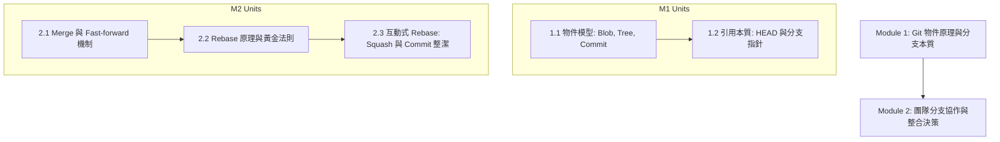

# 手把手教學：從零建立第一堂 NotebookLM 課程

本教學從尚未安裝 Node.js 的電腦開始，帶你完成環境建置、技能安裝、自動模式驗證，以及《Git 版本控制與團隊協作實戰》範例課程。指令一次執行一行；看到每節的「完成判準」後再繼續。

## 先選擇操作模式

建議使用 **auto mode**：代理操作 NotebookLM，你只處理三個關卡——一次 Run Start，以及每批 Source Import、每個 Module Finalization。Google 登入是 Run 的前置操作，不算關卡。若環境無法支援 browser adapter，你可以接受 **guided mode**，再由技能逐步引導網頁操作。

```text
環境建置 → 技能與 adapter 就緒 → AI preflight
                                  ├─ auto：三個確認關卡，其餘由代理操作
                                  └─ guided：依步驟 3–10 操作 NotebookLM
```

**完成判準：** 你已決定優先嘗試 auto mode；adapter 最後仍不可用時，可明確選擇 guided mode。

---

## 步驟 0：建立自動模式環境

### 0.1 開啟終端機

- Windows：開啟「開始」選單，搜尋並啟動 PowerShell。
- macOS：按下 `Command + Space`，搜尋並啟動「終端機」。
- Linux：從應用程式選單啟動 Terminal。

接下來的灰底指令都貼在終端機中。每次只貼一行，按 Enter，等待執行結束後再貼下一行。

### 0.2 安裝並驗證 Node.js

先輸入：

```bash
node --version
```

- 顯示 `v22.8.0` 或更新版本：繼續下一節。
- 顯示「找不到指令」或版本較舊：從 [Node.js 官方下載頁](https://nodejs.org/en/download)下載並安裝 LTS 版本，關閉再重新開啟終端機，然後重試。

再確認 Node.js 附帶的兩個工具：

```bash
npm --version
npx --version
```

**完成判準：** `node`、`npm`、`npx` 三行都顯示版本號，且 Node.js 不低於 `v22.8.0`。

### 0.3 安裝 NotebookLM Course Builder 技能

```bash
npx skills add hmj1026/notebooklm-course-builder
```

若終端機詢問是否繼續，輸入 `y` 後按 Enter。安裝位置由 skills 工具依你的 AI 助手環境處理，不需要手動尋找技能資料夾。

不想自行判讀安裝訊息時，也可以把這段文字貼給 AI 助手：

```text
請安裝 https://github.com/hmj1026/notebooklm-course-builder，
並確認 SKILL.md、scripts/detect-browser-tools.mjs 與 references/automation.md 可讀取。
不要開始建課；完成後只回報安裝位置與驗證結果。
```

若安裝程式要求選擇目標 AI 工具，選取你接下來要開啟課程的助手，例如 Claude Code、Codex 或 Cursor。

**完成判準：** 終端機或 AI 助手明確回報 `notebooklm-course-builder` 已安裝至你要使用的 AI 工具。

### 0.4 安裝首選 Browser Adapter

依序執行：

```bash
npx skills add vercel-labs/agent-browser
npm install -g agent-browser
agent-browser install
agent-browser --version
agent-browser doctor --offline --quick --json
```

版本指令應顯示 `agent-browser` 版本，doctor 結果應為成功且沒有 failed check。需要 `playwright-cli` 備援、使用 `nvm`，或遇到 `PATH` 問題時，再閱讀 [自動模式備援安裝與排錯](browser-automation-setup.md)。若暫時不修復 adapter，也可以在下一節選擇 guided mode。

**完成判準：** `agent-browser --version` 顯示版本，且 doctor 沒有 failed check；或你已決定本次使用 guided mode。

### 0.5 讓 AI 執行 Preflight

技能可能安裝在隱藏資料夾，因此新手不必自行切換到它的目錄。開啟剛才選定且已安裝技能的 AI 工具，在目前教材工作區建立新對話，貼上：

```text
請使用 notebooklm-course-builder 技能，只執行完整 browser preflight，
包含 Node、CLI 與 adapter health check；
不要建立或修改任何 Notebook。請回報 node.ready、mode、selected_adapter，
adapter_health，以及無法進入 auto mode 時的修復建議。
```

成功結果應包含：

```text
node.ready: true
mode: auto
selected_adapter: agent-browser
adapter_health: ready
```

`mode: auto` 是 CLI 候選結果；只有 `adapter_health: ready` 才代表 browser 可以啟動。若完整 preflight 最後回報 guided，可依原因修復，或明確回覆「本次使用 guided mode」。完整對照見 [排錯章節](browser-automation-setup.md#5-常見問題)。

**完成判準：** AI 回報 `node.ready: true`、`mode: auto`、一個 `selected_adapter` 與 `adapter_health: ready`；或你已明確接受 guided mode。

### 0.6 了解第一次登入

正式開始建課時，代理會開啟技能專用的 browser session。請只在該瀏覽器視窗自行登入 Google；帳號、密碼與驗證碼都留在登入頁，不要貼到 AI 對話。登入完成後，代理會顯示本次 Run 的課程、Notebook、起始 checkpoint 與自動寫入範圍，等你確認才開始。

**步驟 0 完成判準：** Node.js 與技能已就緒，而且你已進入 health check 通過的 auto mode，或明確選擇 guided mode。只有 Node.js 或技能尚未就緒時才停在本步排錯。

---

## 步驟 1：建立課程專案工作區

最簡單的方式是讓 AI 助手使用技能內建範本。在目前要存放教材的工作區開啟 AI 對話，貼上：

```text
請使用 notebooklm-course-builder 的範本，在目前工作區建立
courses/git-course/course-outline.md 與 courses/git-course/build-state.md。
若檔案已存在，先停止並告訴我，不要覆寫。
```

若你正在這個 GitHub repository 的根目錄，也可以自行執行。macOS／Linux 使用 Terminal；Windows 請使用 Git Bash 或 WSL，不要在 PowerShell 直接執行 Bash 腳本：

```bash
./scripts/init-course.sh git-course
```

執行後會建立以下結構：

```
courses/git-course/
├── course-outline.md     # 課程大綱
└── build-state.md        # 建課進度與決策
```

若腳本提示目錄已存在，輸入 `N` 取消，再先確認既有內容。只有確定要替換模板時才另行決定是否覆寫。

**完成判準：** 上述兩個檔案存在；新目錄已成功建立，或既有目錄已安全取消且沒有意外覆寫。

---

## 步驟 2：啟動第一個建課 Run

你可以直接貼入零散筆記，不必先整理成正式課綱：

> 「我想為團隊內部建立一門《Git 版本控制與團隊協作》課程，受眾是懂基本指令但常遇到 Conflict、不知道如何 rebase 與整理 commit 的初中階工程師。大綱大概有：Git 內部原理（Blob/Tree/Commit/HEAD）、分支管理與 Fast-forward、Rebase vs Merge 決策、互動式 rebase 整理 commit。不教 GitHub Actions CI/CD。」

### Auto mode 會發生什麼

1. 專用瀏覽器開啟時，由你親自完成 Google 登入。
2. 代理解析課綱、規劃 Notebook 與 Research Cluster。
3. 代理顯示 `Run Start`，列出課程、Notebook、adapter、起始 checkpoint 與預定寫入。
4. 確認內容正確後，選擇「授權本次 Run」。

三個關卡會提供下列選項；選擇暫停或修訂時，代理保留最後 checkpoint，不會把未核准內容記為完成：

| 關卡 | 你要判斷什麼 | 主要選項 |
|---|---|---|
| Run Start | 是否授權這次列出的自動寫入範圍 | 授權本次 Run／改用 guided mode／取消 |
| Source Import | 是否接受建議的來源清單 | 接受並匯入／調整選取／查看理由或暫停 |
| Module Finalization | 是否接受本 Module 成果與下一步 | 接受並完成／依問題修訂／保存並暫停 |

**Auto mode 完成判準：** 代理已取得 Run 授權並開始操作，或停在清楚標示原因的 Exception Gate。Auto mode 使用者到此不需照著後面的網頁步驟操作。

---

## Guided mode 操作範例

只有 preflight 回報 `mode: guided`，或你主動選擇 guided mode 時，才需要繼續步驟 3–10。以下範例示範 AI 如何把課綱結構化並逐步請你操作 NotebookLM。

### Guided mode 的 AI 回覆

```text
[進度: 全課規劃 / 大綱解析]

已為您解析課程結構與先備關係：
- 課程名稱：Git 版本控制與團隊協作實戰
- 目標受眾：具備基本 add/commit 經驗，需強化團隊協作與心智模型的工程師
- 明確不教：GitHub Actions CI/CD、Git 內部 C 原始碼實作

課程結構拓撲：
```

```text
完成判準：請確認 Module 與單元結構是否符合預期？
快速操作／回傳：若無修改請回傳「確認」，我們將展開 Module 1 規劃。
```

---

## 步驟 3：在 NotebookLM 建立筆記本並匯入大綱

### 使用者回傳：
> 「確認」

### AI 代理回覆：
```text
[進度: Module 1 / 筆記本建立]

目前：Module 1: Git 物件原理與分支本質

請在 NotebookLM：
1. 開啟 https://notebooklm.google.com/ 點擊左上角「+ 新增筆記本」，命名為「Git-M1-Object-Model」。
2. 在左側「來源 (Sources)」面板點擊「+ 新增來源」，選擇「複製的文字 (Copied text)」。
3. 貼入下方大綱文字，來源名稱填寫「Module 1 大綱」，點擊「插入」：

---
# Module 1: Git 物件原理與分支本質
- Unit 1.1: Git 物件儲存機制（Blob, Tree, Commit 物件與 SHA-1/SHA-256 定位）
- Unit 1.2: 引用（References）的本質：HEAD、分支指標與 Detached HEAD 狀態修復
---

完成判準：左側來源清單已顯示「Module 1 大綱」。
快速操作／回傳：完成後請回覆「大綱已匯入」。
```

---

## 步驟 4：執行快速研究（Fast Research）與截圖回傳

### 使用者回傳：
> 「大綱已匯入」

### AI 代理回覆：
```text
[進度: Module 1 / Cluster 1 來源研究]

目前：Module 1 / Research Cluster 1 (Git 物件與引用機制)

請在 NotebookLM：
在左側「來源」面板點擊「+ 新增來源」➔ 點擊「快速研究 (Fast Research)」標籤頁，將下方提示詞貼入搜尋列按 Enter：

---
請研究「Git Object Storage Mechanism and References」，作為「Module 1: Git 物件原理與分支本質」的初中階工程師教材來源。

需要支援：
- Git 三大對象（blob, tree, commit）的不可變性與內部哈希定位
- 分支指標（refs/heads）的本質只是 41 位元組檔案
- HEAD 指標的切換機制與 Detached HEAD 的本質與拯救方式
- 心智模型：Git 是一個帶有內容定址檔案系統的有向無環圖 (DAG)

來源優先：
- git-scm.com Pro Git 官方書籍（Scott Chacon）
- 權威技術文件或知名技術手冊

避免：
- 只教 `git add / git commit` 表面操作的入門文章
- 與本單元無關的 GUI 工具（SourceTree / GitKraken）點擊教學

研究目標：讓學習者建立 Git 底層物件與指標的心智模型。
不需要深入：Packed refs 與垃圾回收 (gc) 底層 C 語言演算法。
---

完成判準：NotebookLM 展開候選來源清單。
快速操作／回傳：使用 Windows `Win+Shift+S`、macOS `Cmd+Shift+4`，或 Linux 桌面環境的截圖工具擷取候選視窗。貼回前遮蔽帳號與不相關的 Notebook 名稱。
```

---

## 步驟 5：一鍵審核與極簡勾選碼匯入

### 使用者回傳：
（使用者直接在對話貼入 NotebookLM 候選來源清單截圖）

### AI 代理回覆：
代理透過視覺辨識解析截圖，給出來源審核矩陣與操作指令。下表只是格式示例；實際標題、排序與數量以你的畫面為準，不可直接照抄示例編號。

```text
[進度: Module 1 / 來源審查]

針對截圖中的 4 個候選來源，審核結果如下：

| # | 來源標題 | 網域 | 決策 | 支援單元 | 具體理由 |
|---|---|---|---|---|---|
| 1 | Git Internals - Git Objects | git-scm.com | Import | 1.1 | Pro Git 官方書籍第 10 章，最權威的底層物件儲存規範 |
| 2 | Git Internals - Git References | git-scm.com | Import | 1.2 | 官方對於 refs 與 HEAD 本質的權威說明，不可或缺 |
| 3 | Visualizing Git Concepts | github.io | 可選 | 1.1, 1.2 | 圖解 DAG 與指標運作，適合作為心智模型輔助 |
| 4 | 5 分鐘學會 Git 常用指令 | blog.csdn.net | 不要 Import | — | 僅列常用指令，無底層原理且排版零散 |

示例操作指令：
請在 NotebookLM 候選視窗中：手動勾選 [1, 2, 3]，取消勾選 [4]，點擊右下角「匯入 (Import)」按鈕。

完成判準：左側 Sources 清單顯示已匯入這 3 筆來源。
快速操作／回傳：完成後請回傳「已匯入」。
```

---

## 步驟 6：涵蓋度（Coverage）評估

### 使用者回傳：
> 「已匯入」

### AI 代理回覆：
```text
[進度: Module 1 / 涵蓋度分析]

目前：Module 1 Coverage Analysis

請在 NotebookLM：在中間「對話 (Chat)」面板底部的對話輸入框貼入下列指令並發送：

---
請根據目前 Notebook 的所有 Sources，對「Module 1: Git 物件原理與分支本質」做 Coverage Analysis。

單元：
- Unit 1.1: Git 物件儲存機制（Blob, Tree, Commit）
- Unit 1.2: 引用本質與 HEAD（含 Detached HEAD 狀態）

評定標準：
- 逐單元給出 High / Medium / Low / Missing
- 列出已具備之核心知識與實質缺口
---

完成判準：NotebookLM 給出各單元評級。
快速操作／回傳：貼回評級結果（例如「兩單元皆為 High」）。
```

若這次結果剛好是兩單元皆為 `High`，即可進入講義生成。其他結果依下列分支處理：

- `Medium`：確認缺口不影響核心學習成果，記錄接受理由後才能繼續。
- `Low`／`Missing`：針對一個明確缺口重做 Fast Research 與來源審核，再重跑 Coverage。
- 同一缺口補強兩輪仍不足：縮小單元承諾、改用使用者提供來源，或記錄 blocker 並暫停。

**完成判準：** 所有單元皆為 `High`，或 `Medium` 已有不影響本課程目標的明確接受理由。

---

## 步驟 7：講義 Draft 產出（免全文搬運機制）

### AI 代理回覆：
```text
[進度: Module 1 / 單元 1.1 講義生成]

目前：Unit 1.1: Git 物件儲存機制 Draft v1

請在 NotebookLM：
在中間「對話」面板底部的對話輸入框，貼入下列短版指令並發送（確認左側 3 筆來源皆處於勾選狀態）：

---
請根據目前 Notebook Sources 製作正式講義：

# Unit 1.1: Git 物件儲存機制：Blob, Tree 與 Commit 的不可變本質
建議檔名：unit-1-1-git-object-storage.md

對象：初中階軟體工程師。
完成後，學習者應能：手繪 Git 三大物件關係圖，並解釋為何 Git 是內容定址存儲。

請依序包含：
1. 學習目標
2. 痛點情境：為什麼把 Git 當成「檔案差異快照」會導致直覺錯誤？
3. 核心概念：SHA 哈希定址、Blob 物件、Tree 目錄物件、Commit 封裝
4. 技術細節與資料流：當執行 git add 與 git commit 時，.git/objects 底層發生了什麼？
5. 心智模型：Git 的 DAG（有向無環圖）結構比喻
6. 常見迷思：Commit 可以直接被修改嗎？（Amending 的本質）
7. 課後複習檢查點 (3-5 題)

格式要求：
- 正式教材語氣，嚴謹流暢
- 依據目前 Sources 撰寫並保留原生引用標註 [1], [2]
---

完成判準：NotebookLM 生成完整講義草稿，畫面可見要求的七個章節與來源引用。
快速操作／回傳：不需要貼回全文；請回報「講義已生成，章節與引用可見」，再於同一對話串進行審核。
```

---

## 步驟 8：同串內審雙閉環（In-Notebook Review Loop）

### 使用者回傳：
> 「講義已生成」

### AI 代理回覆：
代理直接給出預設的審查指令，讓 NotebookLM 在同一對話串內自檢，省去 90% 複製貼上時間：

```text
[進度: Module 1 / 單元 1.1 講義審查]

目前：Unit 1.1 講義審核 (In-Notebook Review)

請在 NotebookLM：
在中間「對話」面板（延續剛才生成講義的同一個對話串）底部的輸入框，直接貼入下方審核指令發送：

---
請審查剛才產生的「Unit 1.1: Git 物件儲存機制」講義，不要重寫講義。

以資深 Git 核心架構師角度嚴格檢查：
1. 技術正確性：Blob 是否精確說明「只儲存檔案內容，不包含檔名與權限」？
2. 資料結構：Tree 物件如何將檔名、模式與 Blob/Tree SHA 連結？
3. 心智模型：是否清晰建立「Git 不記錄 diff，而是記錄完整 Tree 快照」的不可變模型？
4. 來源支援：主要技術主張是否皆有 Sources 引用支援？
5. 邊界控制：是否守住邊界，未提前深入講解 Unit 1.2 的分支指針與 HEAD？

只判定：
- PASS
- Needs Minor Revision
- Needs Major Revision

若需修改，只列具體可執行項目（不要提出文風或排版偏好）。
---

完成判準：NotebookLM 給出審查判定。
快速操作／回傳：貼回判定結果（例如：「PASS」或列出 1~2 個修改項）。
```

依判定選路：

- `PASS`：進入 Final Check。
- `Needs Minor Revision`：請 AI 根據問題清單產生最小修訂 Prompt，生成 v2 後再進入 Final Check。
- `Needs Major Revision`：先回到 Coverage 或 Draft 規格修正，不直接定稿。

---

## 步驟 9：Final Check 與存檔至 Studio 記事區

Review 為 `PASS`，或 Minor Revision 已產生 v2 後，在同一 NotebookLM 對話輸入：

```text
請對剛才的 Unit 1.1 正式候選版本做 Final Check。

只檢查：
1. Review 問題是否已解決
2. 是否引入新技術錯誤
3. 主要主張是否有來源支援
4. 是否符合受眾與 Unit 1.1 邊界

只輸出 PASS 或 FAIL。FAIL 時只列阻止定稿的問題。
```

- `FAIL`：把問題交給 AI 產生最小修訂 Prompt，修正後重跑 Final Check。
- `PASS`：找到正式講義回答，點擊「儲存至記事 (Save to note)」，確認右側 Studio 出現記事。

接著對 Unit 1.2 重複步驟 7–9。不得因 Unit 1.1 通過便假設 Unit 1.2 已完成。

**完成判準：** Unit 1.1 與 Unit 1.2 都有各自的 Review、Final Check `PASS` 與 Studio 正式記事。

---

## 步驟 10：產出測驗（Quiz）與學習指南（Study Guide）

兩個單元都定稿後，先在 NotebookLM 對話輸入 Module Review：

```text
請驗收整個 Module 1，檢查單元順序、知識斷層、重複、術語首次介紹、
技術矛盾、範圍與來源支援。

只輸出：
- PASS 或 Needs Revision
- 是否可進入下一 Module：YES 或 NO
- 阻止通過的具體問題
```

- `Needs Revision` 或 `NO`：只修正列出的阻塞單元，再重跑 Module Review。
- `PASS + YES`：進入 Quiz 與 Study Guide。

在右側 Studio 依序點擊「測驗 (Quiz)」與「學習指南 (Study Guide)」。若介面沒有快捷卡片，分別在對話中要求：

```text
請為 Module 1 建立 5 題情境理解型測驗，每題附答案與解析。

請為 Module 1 建立學習指南，包含核心能力、心智模型、常見誤解、
單元連結與建議複習順序。
```

最後封存 Module 1：將正式單元、核准來源、接受的 Coverage 限制、Module Review、Quiz 與 Study Guide 記入 `build-state.md`，把 Module 與相關 Research Cluster 標記為完成或 `Closed`。仍有下一 Module 時，先記錄下一本 Notebook 與 Research Cluster 規劃，再回到建立 Notebook 的步驟。

**完成判準：** Module Review 為 `PASS + YES`，Quiz 與 Study Guide 均可見；Module 1 的成果與限制已封存，相關狀態已標記完成或 `Closed`，且下一 Module 或全課完成狀態已寫入狀態表。

---

## 步驟 11：進度中斷與隨時接關 (/resume)

建課通常無法一次完成。當你中途關閉終端機或隔天繼續時：

1. 重新開啟原本的教材工作區與 AI 助手。
2. 在 AI 對話輸入 `/resume` 或「繼續進度」。
3. 代理讀取 `build-state.md`，回報最後一個已驗證 checkpoint。
4. Auto mode 會重新執行 preflight，並請你授權新的 Run；先前 Run 的授權不會沿用。Guided mode 則直接顯示下一個手動步驟。

**完成判準：** 代理回報的課程、Module、Notebook 與 checkpoint 都和中斷前一致；不一致時先修正狀態，不繼續操作。

---

## 新手常見問題與防呆提醒 (FAQ)

| 常見情境 | 發生原因 | 正確處置方式 |
|---|---|---|
| **Preflight 顯示 `mode: guided`** | Node.js 版本或 browser adapter 未達條件 | 依 [自動模式排錯表](browser-automation-setup.md#5-常見問題)處理；修復後重新執行 preflight。 |
| **自動模式沒有開啟瀏覽器** | adapter 尚未安裝 browser engine，或 session 啟動失敗 | 執行 `agent-browser install` 後再試一次；仍失敗時把完整錯誤貼給 AI，不貼帳號或密碼。 |
| **Google 要求重新登入** | 專用 session 的登入已失效 | 在代理開啟的專用視窗自行登入，再回覆「登入完成」。 |
| **研究提示詞被當成來源** | 誤將 Fast Research Prompt 貼到「複製的文字」 | 前往左側來源面板，點擊該錯誤項目旁邊的三點圖示選擇「移除來源」，重新將提示詞貼入「快速研究」搜尋框。 |
| **候選來源過多/質量不一** | 搜尋詞包含廣泛關鍵字 | 截圖貼回給 AI，AI 會標註哪些是內容農場並給出「極簡勾選碼」，切勿點擊「全選」。 |
| **講義審核為 Needs Minor Revision** | 有局部且可明確修復的問題 | 讓代理依問題清單產生最小修訂 Prompt，生成 v2 後執行 Final Check。 |
| **講義審核為 Needs Major Revision** | 來源或講義結構不足 | 回到 Coverage 或 Draft 規格修正，再重新 Review；不要直接存正式記事。 |
| **Final Check 為 FAIL** | 修訂未完成或引入新問題 | 只修正列出的阻塞問題並重跑 Final Check；通過前不標記完成。 |
| **在記事區無法直接修改文字** | NotebookLM 的 Saved Notes 預設唯讀 | 點擊卡片右上角 `...` 選擇「匯出至 Google 文件」進行後續微調，或複製全文回本機 Markdown。 |
